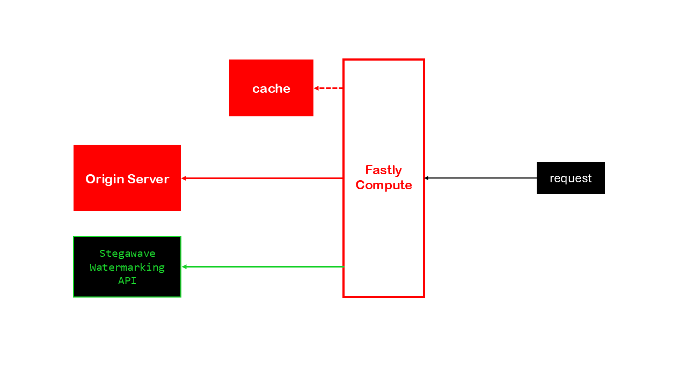
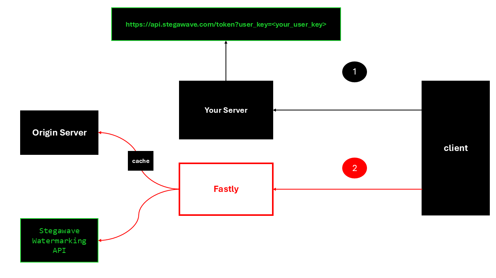

# StegaWave Dynamic Audio Watermarking for Fastly Compute

This Fastly Compute application provides a CDN layer in front of your origin server where playlist files are served for your content. It dynamically watermarks a small percentage of audio segments with unique identifiers (128-bit user keys), allowing you to trace content back to specific users or sessions.

The watermarking process is transparent to your existing streaming infrastructure - the Fastly service acts as a reverse proxy, selectively watermarking 1% of fMP4 (CMAF) audio segments before delivering them to end-users.



## How It Works

The watermarking system operates with a **1% probability** (controlled by the `WATERMARK_PROBABILITY` variable in `main.rs`). This can be adjusted, but it is recommended to stay in the 1%-10% range. With typical 6-second segments at 1% watermarking probability, users will receive an average of one watermarked segment every 10 minutes (100 segments).



**Important:** Content **MUST** be in fMP4 (CMAF) format for watermarking to work. 

## Disclaimer

The watermarking will **NOT** work if the content is DRM-encrypted.

**Content Requirements:** Your streaming content must be in fMP4 (CMAF) format for the watermarking to function properly.

## Prerequisites

Before setting up this service, ensure you have:

- **Origin server** hosting your streaming content (fMP4/CMAF format)
- **Frontend/application server** for serving your client application and issuing JWT tokens
- **Rust** toolchain installed (required for Fastly Compute@Edge)
- **Fastly CLI** installed and authenticated
- **Fastly API token** for service deployment
- **StegaWave API key** for watermarking service access

## Setup Instructions

### Step 1: Configure CONFIG.txt

First, fill out the `CONFIG.txt` file in the root directory with your specific configuration:

```plaintext
# Fastly service name
NAME=your-service-name

# Origin server for HLS/DASH manifests and segments
ORIGIN_1=your-origin-server.com

# Your StegaWave API key
STEGAWAVE_API_KEY=your_api_key_here

# Fastly API token
FASTLY_API_TOKEN=your_fastly_token_here

# Audio encoding parameters (configure based on your content)
FMP4_AAC_PROFILE=AAC-LC
FMP4_SAMPLE_RATE=44100
FMP4_CHANNELS=2
FMP4_TRACK_ID=1
```

### Step 2: Deploy the Fastly Application

Run the setup script to deploy the Fastly service:

```bash
./setup
```

This will build and deploy the Rust application, create necessary KV stores, and configure the service with your settings.

### Step 3: Setup Your Server for JWT Token Issuance

Configure your application server to issue JWT tokens for each client. Every client must use a JWT token issued from the StegaWave API before streaming begins.

**Token Request (from your server to StegaWave API):**
```
GET https://api.stegawave.com/token?user_key=<your_user_key>
Headers:
  X-API-Key: your_stegawave_api_key
```

**Response:**
```json
{
  "token": "eyJhbGciOiJIUzI1NiIsInR5cCI6IkpXVCJ9..."
}
```

**Important:** The `user_key` should be a unique identifier for your users (such as a user ID or email address). This will be hashed to a 128-bit user key and embedded into the audio segments for watermarking.

You can test your token generation setup using the provided test program:

```bash
./test
```

### Step 4: Configure Client-Side Player

Ensure your video player adds the JWT token as a query string parameter (`token`) to all requests to the Fastly CDN, as shown in the flow diagram above.

This repository includes templates for popular players:

- **`THEOplayer_template.html`**: Uses `requestInterceptor` to add the token parameter
- **`Bitmovin_template.html`**: Uses `preprocessHttpRequest` network configuration

Replace the placeholder stream URLs and license keys in these templates with your own.

## Setup Script Usage

The setup script provides several commands for managing your deployment:

### Available Commands

- **`./setup`**: Initial deployment (same as `./setup install`)
- **`./setup install`**: Full setup and deployment
- **`./setup update`**: Update KV store configuration values
- **`./setup deploy`**: Redeploy the service after code changes
- **`./setup tail`**: View real-time service logs
- **`./setup restore`**: Restore project to template state

### Command Options

```bash
# Install with pre-provided credentials
./setup install --fastly-token "your_token" --stegawave-api-key "your_key"

# Update specific configuration keys
./setup update --keys "FMP4_SAMPLE_RATE,FMP4_CHANNELS"

# Deploy without rebuilding
./setup deploy --skip-build

# Tail logs with pre-provided token
./setup tail --fastly-token "your_token"
```

The setup script will automatically handle:
- Building the Rust application
- Creating Fastly service and backends
- Setting up KV stores for configuration
- Populating configuration values
- Deploying the service
